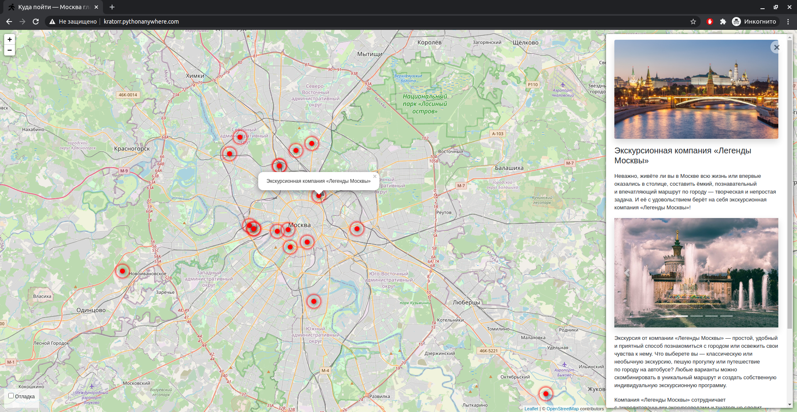

# Куда пойти
Cайт о самых интересных местах в Москве.

## Запуск

- Скачайте код
- Установите зависимости командой `pip install -r requirements.txt`
- Создайте БД командой `python3 manage.py migrate`
- Запустите сервер командой `python3 manage.py runserver`

## Переменные окружения

Часть настроек проекта берётся из переменных окружения. Чтобы их определить, создайте файл `.env` рядом с `manage.py` и запишите туда данные в таком формате: `ПЕРЕМЕННАЯ=значение`.

Доступны 2 переменные:
- `DEBUG` — дебаг-режим. Поставьте `True`, чтобы увидеть отладочную информацию в случае ошибки.
- `SECRET_KEY` — секретный ключ проекта

## Цели проекта

Код написан в учебных целях — это урок в курсе по Python и веб-разработке на сайте [Devman](https://dvmn.org).
